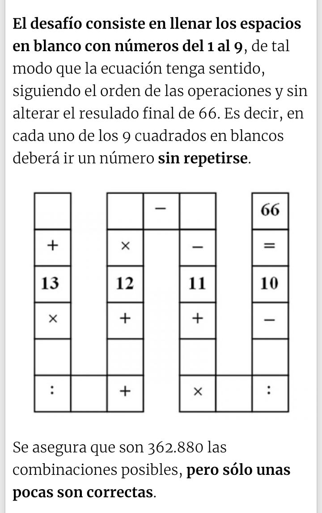

# Equation Riddle

**El desafio consiste en llenar los espacios en blanco con números del 1 al 9**, de tal modo que la ecuación se cumpla, siguiendo el orden de las operaciones y sin alterar el resultado final de 66. Es decir, en cada uno de los 9 cuadrados en blanco deberá ir un número **sin repertirse**.

Para ver solucion ir al [jupyter notebook](./jupyter/SolTebinski.ipynb)
