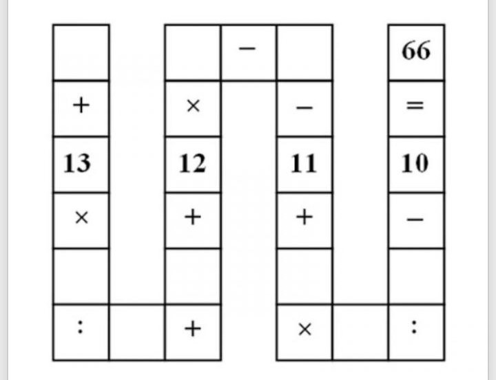

# equationSudokuSolver
A simple equation where we have to use all 1 to 9 numbers to be solved. See img below

## Esta forma de añadir una imagen no nos da control sobre su tamaño
``

## Esta otra me parece más útil
Y ademas utilizamos los subtitulos en MarkDown ^^ 

**El desafio consiste en llenar los espacios en blanco con números del 1 al 9**, de tal modo que la ecuación tenga sentido, siguiendo el orden de las operaciones y sin alterar el resultado final de 66. Es decir, en cada uno de los 9 cuadrados en blanco deberá ir un número **sin repertirse**.

``

